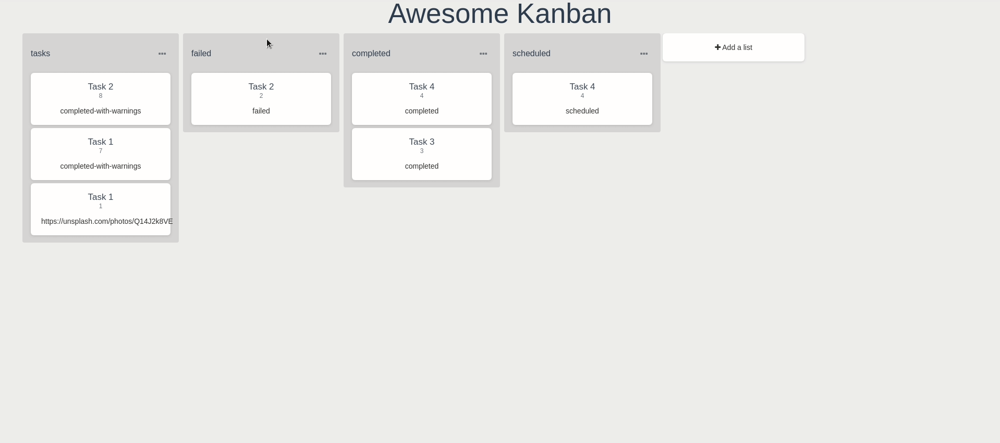

---
{
  "title": "Awesome Kanban",
  "lang": "en-US"
}
---

# Awesome Kanban

The Awesome Kanban allows you to create view in `Trello` style.



## Dependencies

* vuedraggable `npm install vuedraggable`

## Props
### lists
type: `Array (default: [], required: false)`

This is an array of object that contains all list you want to create.
The list object has 2 properties :
* `title` : `Name of the list`
* `content` : `Array of object with values`

```vue
<awesome-kanban
  :lists="lists"
/>
```

```js
//example
data: () => ({
  lists: [
    {
      title: 'Shopping List',
      content: [
        {
          id: 1,
          name: 'Banana'
        },
        {
          id: 2,
          name: 'Apple'
        },
      ]
    }
  ]
})
```

### columns
type: `Array (default: [], required: false)`
This is the columns provided by schema to display.
This allows to not display all the values in schema, only the values selected.

```vue
<awesome-kanban
  :lists="lists"
  :columns="columns"
/>
```

### kanbanOptions
type: `Object (default: defaultKanbanOptions)`

This is the configuration of the `Kanban` component.

* **scrollSensitivity**
    
    * type: `Number`
    * defaultValue: `200`
    
    This is the value to determine the scroll sensitivity, that allows user to drag an item to the farest list.
    
* **animation**

    * type: `Number`
    * defaultValue: `200`
    
    This is the duration in milliseconds of the moved animation.
    
* **moveList**

    * type: `Boolean`
    * defaultValue: `false`
    
    By default, user cannot move the lists. 

* **moveCard**

    * type: `Boolean`
    * defaultValue: `true`
    
    Allow you to disable the card moving.
    
* **fields**

    * type: `Object`
    * defaultValue : `{ title: 'name', 'subtitle': 'id', 'description': 'status' }`
    
    In the card there are only 3 fields that are displayed. This allows you to define which field you want display.
    
* **filterField**

    * type: `String`
    * defaultValue: `status`
    
    Allow you to create by default list from a determined `Field`. Need `filterValues`.
    
* **filterValues**

    * type: `Array`
    * defaultValue: `['failed', 'completed', 'scheduled']`
    
    Allow you to determine which value is used to create a list. Need `filterField`.
    
* **sortField**

    * type: `String`
    * defaultValue: `id`
    
    Allow you to change to default sort the list by a `Fields`.
    
* **sortOrder**

    * type: `String`
    * defaultValue: `DESC`
    * availableValue: `['ASC', 'DESC']`
    
    Allow you to change the sort order. Link with `sortField`.
    
## Events
### @removeList
Event emitted when a list is removed
Return list name.
```vue
<awesome-kanban
   :lists="lists"
   :columns="columns"
   @removeList="onRemoveList"
/>
```
```js
methods: {
  onRemoveList(listName) {
    //
  }
}
```
### @listChanged
Event emitted when a list is changed
Return 
```vue
<awesome-kanban
   :lists="lists"
   :columns="columns"
   @listChanged="onListChange"
/> 
```
```js
methods: {
  onListChange(event) {
    // event = { moved: { element: { content: [], title:"Shopping list" }, newIndex: 3, oldIndex: 2} }
  }
}
```
### @cardChanged
### @cardClicked
### @customListAction